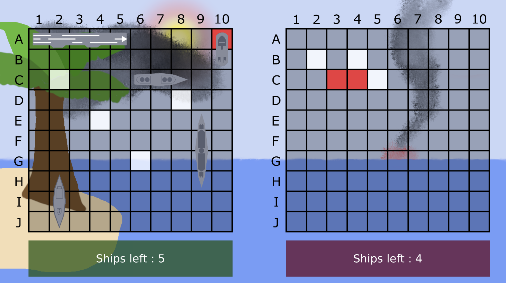

# Naval War

Naval War is a C++ implementation of the classic naval combat board game, made for fun and for my daughters.



## Gameplay

Each player places their fleet on a grid, then takes turns calling out coordinates to find and sink the opponent's ships. The first player to sink the entire enemy fleet wins. Currently, only single-player mode against a computer opponent is available.

While placing your fleet, right-click to rotate a ship between horizontal and vertical.

## Platform Support

Developed and tested on Linux and macOS. Windows is not officially supported, though it may work with minor adjustments.

## Installation

### Install dependencies (Arch Linux)
```bash
sudo pacman -S gcc cmake sdl3 sdl3_image sdl3_ttf jsoncpp
```

### Install dependencies (Fedora)
```bash
sudo dnf install gcc cmake SDL3 SDL3-devel SDL3_image SDL3_image-devel SDL3_ttf SDL3_ttf-devel jsoncpp jsoncpp-devel
```

### Install dependencies (macOS)
```zsh
brew install cmake sdl3 sdl3_image sdl3_ttf jsoncpp
```

### Compile and install project
```bash
cd navalwar

mkdir build
cd build

cmake ..
make
sudo make install
```

### Uninstall
```bash
cd navalwar/build
sudo make uninstall
```
## Configuration

You can change the game's configuration by editing "etc/navalwar/config.json". 

Supported resolutions:
* 1280x720
* 1920x1080
* 3840x2160

You can set the locale to `"auto"` for the game to detect your system language and fall back to English if no translation is available. It can also be set to a specific language code directly. Translations are currently available for:
* English (en)
* French (fr)

Log levels:
* Critical
* Error
* Warning
* Information
* Debug

Example configuration:
```json
{
    "window": {
        "title": "Naval war",
        "resolution": {
            "width": 1280,
            "height": 720
        }
    },
    "locale": "fr",
    "logLevel": "Information"
}
```

## Contributing

Bug reports and pull requests are welcome. Feature requests too, though they may be declined if they fall outside the scope of the project — this is a small hobby project, not a commercial product, and it will stay that way.

Changes will be reviewed at my own pace.

## License

This project is licensed under the **GNU General Public License v3.0** (GPL-3.0). See the [LICENSE](LICENSE) file for details.

### Third-party dependencies

All dependencies use permissive licenses compatible with the GPL-3.0:

| Dependency | License |
|---|---|
| [SDL3](https://github.com/libsdl-org/SDL) | zlib |
| [SDL3_image](https://github.com/libsdl-org/SDL_image) | zlib |
| [SDL3_ttf](https://github.com/libsdl-org/SDL_ttf) | zlib |
| [jsoncpp](https://github.com/open-source-parsers/jsoncpp) | MIT / Public domain |
| [DejaVu / Bitstream Vera fonts](https://dejavu-fonts.github.io/) | Bitstream Vera (permissive) |